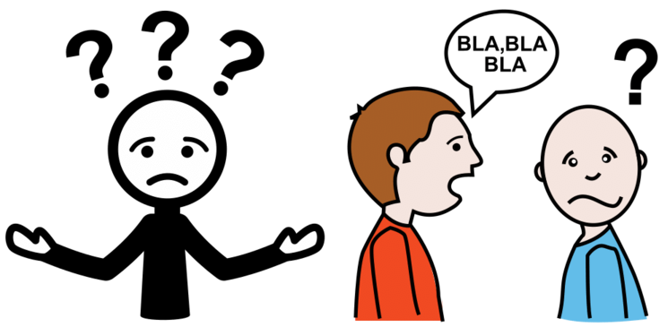
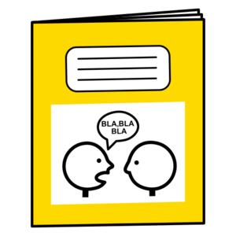
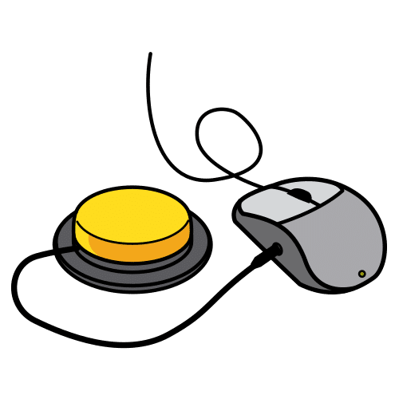
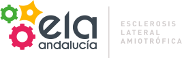

author: Rafael García Cabrera
title: Tecnología Comunicación
subtitle: 9 noviembre 2024 (Jaén)
cover: images/jornada.png
lang: es
theme: ribbon

## Tecnología para la Comunicación

## SAAC

> Los **Sistemas Aumentativos y Alternativos de Comunicación (SAAC)** son formas de expresión diferentes del lenguaje hablado que tienen como objetivo aumentar el nivel de expresión (aumentativo) y/o compensar (alternativo) las dificultades de comunicación que presentan algunas personas en este área.

[¿Qué son los Sistemas Aumentativos y Alternativos de Comunicación (SAAC)?](https://arasaac.org/aac/es)

## Productos de apoyo para la comunicación

> Podemos dividir los productos de apoyo para la comunicación en básicos y tecnológicos. Los **tableros de comunicación** son productos de apoyo básicos que consisten en superficies de materiales diversos en las que se disponen los símbolos gráficos para la comunicación (fotografías, pictogramas, letras, palabras y/o frases) que la persona indicará para comunicarse. Cuando los símbolos se distribuyen en varias páginas hablamos de **libros de comunicación**.

[¿Qué son los Sistemas Aumentativos y Alternativos de Comunicación (SAAC)?](https://arasaac.org/aac/es)

## Libro de comunicación

[EJEMPLO GENÉRICO DE LIBRETA DE COMUNICACIÓN](https://www.dropbox.com/s/ta0uhb1wuyjpbxo/CACE_Word_Castell%C3%A0_5x7_170314.docx?e=1&dl=0)

## 5 Estrategias

> Para indicar los símbolos gráficos en los comunicadores, tableros y libros de comunicación existen [cinco estrategias fundamentales]((https://arasaac.org/aac/es)), a saber:

- Selección directa
- Selección con ratón
- Exploración o barrido dependiente
- Exploración o barrido independiente
- Selección codificada

## ETRAN (Eye Transfer)

- [Tableros de comunicación en la Plataforma de afectados de ELA](https://sites.google.com/site/plataformadeafectadosela/etran)
- [Eye Gaze Communication Board](http://wiki.cogain.org/index.php/Eye_Gaze_Communication_Board)

## BUENAS ESTRATEGIAS PARA COMUNICARNOS CON LA MIRADA

1. Consensuar la forma de decir SÍ y NO.
2. Explicar muy bien la metodología de la señalización.
3. Confirmar en voz alta cada paso, cada señalización con la mirada.
4. Construir el mensaje y confirmar su veracidad.
5. Fomentar la iniciativa de la persona no oral

## Tómate tu tiempo

> Un factor determinante para una buena comunicación es el **TIEMPO**.

Los tiempos para la toma de turnos, han de ampliarse, lo que significa un esfuerzo importante de adaptación por parte de los interlocutores.

## Ratón con pulsadores

## Soluciones para HABLAR (ELA Andalucía)

[https://www.elaandalucia.es/soluciones-para-hablar/](https://www.elaandalucia.es/soluciones-para-hablar/)

## Enlaces web

- [Derecho a la comunicación - Kathrin habla con sus ojos](https://rafagc.neocities.org/talks/importante.html)
- [https://store.lowtechsolutions.org/](https://store.lowtechsolutions.org/)
- [https://www.optikey.org/](https://www.optikey.org/)
- [https://www.tecnoaccesible.net/](https://www.tecnoaccesible.net/)
- [Unitat de Tècniques Augmentatives de Comunicació (UTAC)](https://www.utac.cat/inici)
- [Catálogo de Productos de Apoyo CEAPAT IMSERSO](https://catalogoceapat.imserso.es/)
- [https://acecentre.org.uk/resources/speakbook](https://acecentre.org.uk/resources/speakbook)
- [Enable Viacam](https://eviacam.crea-si.com/index_es.php)
- [Plaphoons - Jordi Lagares](https://projectefressa.blogspot.com/)

## Bajo Coste

- [Catálogo de ideas - Bajo Coste](http://www.crmfalbacete.org/recursosbajocoste/listado_catalogo.asp)
- [Timbre inalámbrico adaptado para pulsadores](http://www.crmfalbacete.org/recursosbajocoste/catalogo/Timbre_inalambrico_adaptado_para_pulsadores.pdf)
- [Varilla para pasar las páginas de los libros](http://www.crmfalbacete.org/recursosbajocoste/catalogo/pasa_paginas.pdf)
  - [https://youtu.be/O0lRqL0oQP4](https://youtu.be/O0lRqL0oQP4)
- [Silla de ruedas 4 pulsadores](http://www.crmfalbacete.org/recursosbajocoste/catalogo/silla_cuatro_pulsadores.pdf)
  - [https://youtu.be/uL-nyLF2Ro8](https://youtu.be/uL-nyLF2Ro8)
- [Pulsador barbilla](http://www.crmfalbacete.org/recursosbajocoste/catalogo/ToP_Otro_pulsador.pdf)
  - [https://youtu.be/SSYWtzF1iok](https://youtu.be/SSYWtzF1iok)

## Slide presentation credits

Slides generated from **Slide Show (S9)**:

- [Slide Show (S9) a free web alternative to PowerPoint and Keynote in Ruby](https://slideshow-s9.github.io/)
	- [License. The slide show scripts and templates are dedicated to the public domain. Use it as you please with no restrictions whatsoever.](https://slideshow-s9.github.io/#about)

- [Template: Shower HTML presentation engine](https://github.com/shower/shower)
	- [Licencia MIT](https://github.com/shower/shower/blob/master/LICENSE.md)
